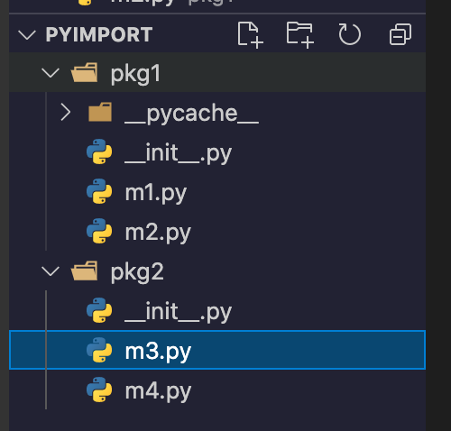

# Python imports

absolute imports vs relative imports:

- https://realpython.com/absolute-vs-relative-python-imports/
- https://stackoverflow.com/questions/14132789/relative-imports-for-the-billionth-time


Example: assume we have two packages in folders



`m1.py`

```python
def func1():
    print('func1')


def func2():
    print('func2')

```

`m2.py`

```python
from .m1 import func1

from . import m1

func1()
m1.func2()

```

Then in the root dir, you can run:

```bash
$ python -m pkg1.m2
func1
func2
```

- If there's no  `__init__.py` in folder pkg1, then the above command won't work.
- **relative imports can be used only inside packages, scripts can't import relative**, that's why we need to run m2 as a module in a package


## import search order

https://docs.python.org/3/tutorial/modules.html#the-module-search-path

Python search for module in the above order.

### What will happen if same module name in different path?

E.g, we have two directories with same package name: `/path1/p/a/b/c` and `/path2/p/x/y/z`

And `sys.path=['/path1', '/path2']`, when we can `import p.a` but not `import p.x`

The idea is: Python will search for package `p` first, and find it in `/path1`, so `import p.x` won't work.


## current imported modules

`sys.modules` keeps record or currently imported modules, a mapping from module name to path

