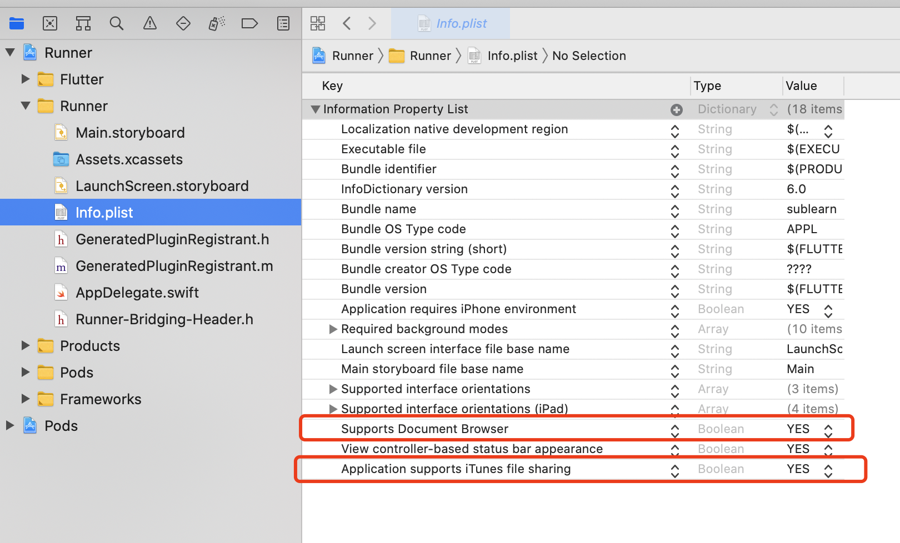
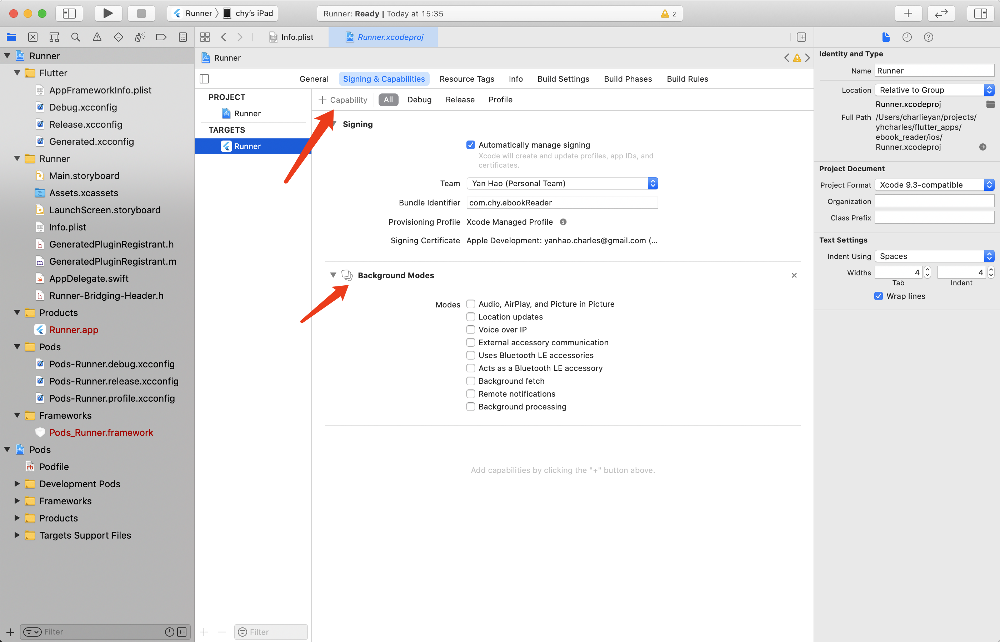

# Flutter Tips

## How to build IPA file for flutter projects?

1. `flutter build ios` this gives you `.app` file in your `build/ios/iphoneos` folder
2. Createa folder with name `Payload`
3. Put your `.app` file into `Payload` folder
4. Compress `Payload` folder into a zip package, and change the extension name to `.ipa`


https://www.jianshu.com/p/2f44d5b57fe7

## Enable file sharing with iTunes

https://stackoverflow.com/questions/6029916/how-to-enable-file-sharing-for-my-app




## Enable background play



## Accesing file on MacOS

For accessing files on MacOS, we need to change the config of xcode project (plist). 

## Depends on a git commit

Example:

```yaml
just_audio:
  git:
    url: git://github.com/ryanheise/just_audio.git
    ref: f1aaa0b132021c3dcd287541eccbb47d63f7e9fe
```


## Convert ASS to SRT

`pip install asstosrt`


## Catch Navigator pop event

https://cogitas.net/know-user-tapped-back-button-back-navigation-arrow-flutter/

Wrap the widget with `WillPopScope`, implement the `onWillPop` callback.

https://api.flutter.dev/flutter/widgets/WillPopScope-class.html


## Dark theme

https://stackoverflow.com/a/62607827/6526184

```dart
MaterialApp(
      title: 'App Title',
      theme: ThemeData(
        brightness: Brightness.light,
        /* light theme settings */
      ),
      darkTheme: ThemeData(
        brightness: Brightness.dark,
        /* dark theme settings */
      ),
      themeMode: ThemeMode.dark, 
      /* ThemeMode.system to follow system theme, 
         ThemeMode.light for light theme, 
         ThemeMode.dark for dark theme
      */
      debugShowCheckedModeBanner: false,
      home: YourAppHomepage(),
    );
```

## Sync execution after async function

https://stackoverflow.com/a/54647682/6526184

```dart
asyncFunc().whenComplete(
  () {
    doSomething();
  }
);
```

