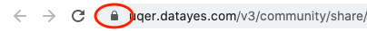

https://experienceleague.adobe.com/docs/target/using/experiences/vec/troubleshoot-composer/mixed-content.html?lang=en#task_FF297A08F66E47A588C14FD67C037B3A

Chrome by default will block insecure content. For example (https://uqer.datayes.com/v3/community/share/5b6becf091bb35012b0b0da7) trys to load images from "http://...", which will not be shown in chrome.

Solution:

1. click the "lock" icon in address bar:

2. in the pop-up menu, click site settings:
   
3. change "insecure content" to be "allow"
   