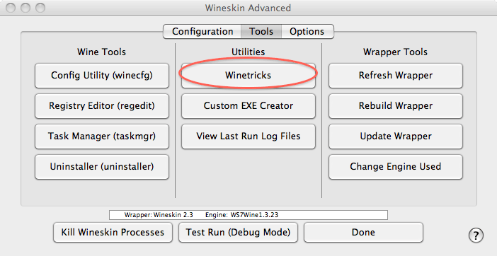

## Run Windows App in MacOS

- Use WineSkin
- WineSkin can be used to create a wrapper app in MacOS, so that the Windows App can be started easily
- Since MacOS Catalina is 64bit and it has deprecated the support of 32bit apps, if you need to run some old Windows 32bit App, follow this: https://www.youtube.com/watch?v=0X4IJPFB9dg
- To add CJK font support: https://iusesoft.info/play-pes2011-on-mac-via-wineskin/, in the app's WineSkin config, choose Winetricks, and run the command "cjkfonts"
- 

- Winetricks can also install DirectX 9
- 

Ref:

- https://www.youtube.com/watch?v=alivMtCd9_U

