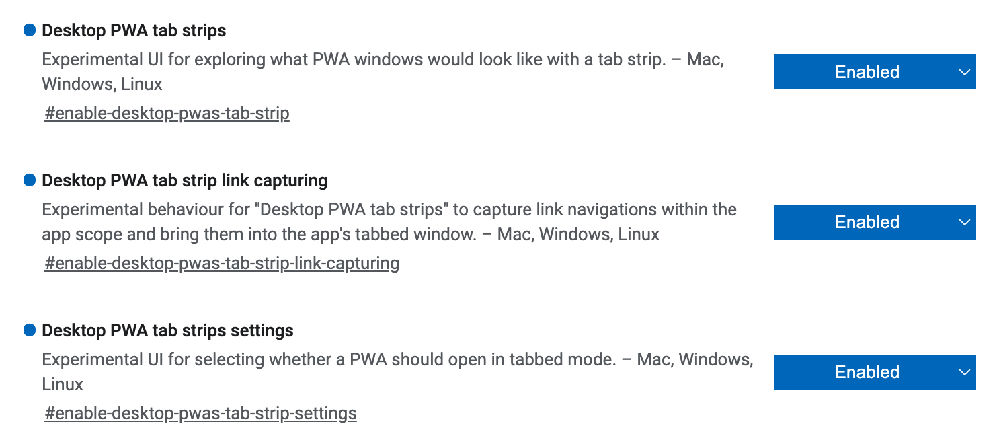

# Using PWA instead of native Apps

PWA is very convenient and sometimes even better than native Apps:

1. No need to install a native App, which usually cost >100MB disk space. The size of a typical PWA is <2MB.
2. You can turn almost any website into a PWA (or a browser App) using Chrome or Edge now.
3. You can use the PWA together with browser extensions. For example, note-taking Apps like Notion/Quip can be used together with Grammarly to check you grammar instantly.

Here are some tips of how to make better use of a PWA.

### Install Any Web Page as an App

If the web page itself is PWA enabled, you should see an icon in the address bar, which allows you to install it locally. If it's not enabled, you can still do it by creating a "shortcut". Here is how:

* For Chrome: settings -> "More Tools" -> "Create Shortcut..."
* For Edge: settings -> "Apps" -> "Install This Site as an App"

For the Apps installed, they look like an App, but are still a web page, and all extensions installed in the browser will work.

### Enable Tabs

Tabs are useful and convenient to organize the windows. But for PWA, by default there's no tab bar as in the browser. We can turn this feature on by changing some flags.

Open flags config by entering `chrome://flags` or `edge://flags` in the address bar. Then search for `pwa` options, and turn on these options:

Then restart the browser, and maybe also reinstall the Apps. When a new App is installed, there will be a dialog box to select which mode this App should work in. Choose “Open as a tabbed window".

